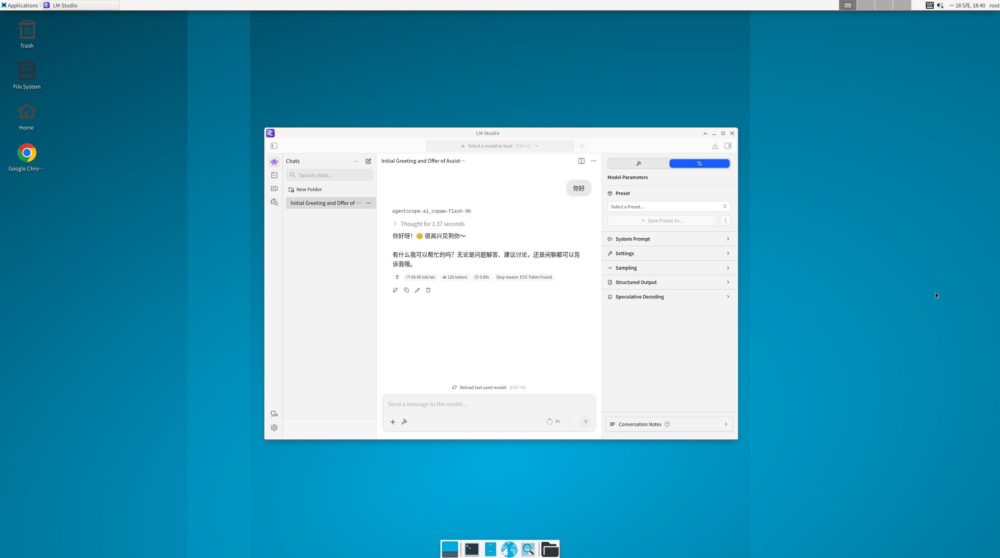

# LM Studio Docker (Guacamole Remote Desktop)

Author: VUYOYO

## 1. Project Overview

This project runs LM Studio inside Docker with an XFCE desktop and provides browser remote access through Guacamole.
The XFCE desktop provides a Chrome browser for viewing documents.



Current architecture:

- LM Studio container: desktop, LM Studio app, x11vnc, API service (container internal port 1234)
- guacd container: Guacamole protocol proxy
- guacamole container: web access entry

Additional features of the project:

- The XFCE desktop provides a Chrome browser for viewing documents.
- Within the XFCE desktop, if LM Studio is closed, it will automatically restart.
- An HTTP standalone clipboard using UTF-8 encoding, supporting various characters including Chinese. (HTTPS required)


## 2. Host Requirements

### 2.1 Common

- Docker Engine or Docker Desktop (Compose v2)
- At least 16 GB RAM recommended
- NVIDIA GPU recommended

CUDA readiness on host is required for NVIDIA path.


### 2.2 Linux Host (recommended path)

- NVIDIA driver installed and working (`nvidia-smi` available)
- NVIDIA Container Toolkit installed
- Docker daemon can run GPU containers

### 2.3 Windows Host
- If you are using a Windows computer, it's better to use the Windows version of LM Studio.
- Windows 10/11
- Docker Desktop with WSL2 backend enabled
- Latest NVIDIA driver installed on host
- Docker Desktop GPU support enabled
- Host check commands:
	- `nvidia-smi` should run successfully in Windows terminal
	- `wsl -d <your-distro> nvidia-smi` should run successfully inside WSL

### 2.4 CUDA / GPU Runtime Completeness Checklist

- Driver and CUDA runtime visibility:
	- `nvidia-smi` returns GPU information without errors
	- In container, `nvidia-smi` is available (after container start)
- Docker GPU wiring:
	- `docker run --rm --gpus all nvidia/cuda:12.6.1-cudnn-devel-ubuntu22.04 nvidia-smi`
	- command should print GPU details successfully
- Optional toolkit check on host:
	- `nvcc --version` (optional for this project; not required if runtime path works)

### 2.5 Known Issues

- Based on my testing, the NVIDIA 570 driver may cause LM Studio's runtime to incorrectly display as incompatible with CUDA and Vulkan, but this does not affect actual inference capabilities.

- Based on my testing, I currently recommend upgrading to the 580 driver, as the runtime displays correctly with the 580 driver.

## 3. Configuration (.env)

Edit [.env](.env) before first run.

Important fields:

- `GUAC_WEB_PORT`: Guacamole web port on host, default `8888`
- `LMS_API_PORT`: LM Studio API port on host, default `1234`
- `GUAC_WEB_HTTPS_ENABLE`: HTTPS toggle for Guacamole web port
- `LMS_API_HTTPS_ENABLE`: HTTPS toggle for LM Studio API port
- `GUAC_USERNAME` / `GUAC_PASSWORD`: Guacamole login account
- `GUAC_TARGET_PASSWORD`: VNC password used between Guacamole and desktop service

Critical warning:

- Do NOT change LM Studio API port in LM Studio UI.
- Container internal API is fixed to `1234`.
- If you need another host port, change only `LMS_API_PORT` in [.env](.env).

## 4. Start

This repository provides two compose modes:

- Release mode (default): `docker-compose.yml` uses image `vuyoyo/lmstudio-guacamole:latest`
- Local mode: `docker-compose.local.yml` overlays local build while keeping the same image name

Run in project root:

Release mode (default):

```bash
docker compose up -d
```

Local mode (build from local source):

```bash
docker compose -f docker-compose.yml -f docker-compose.local.yml up -d --build
```

Access URLs:

- Guacamole Web: `http://` or `https://<host-ip>:<GUAC_WEB_PORT>` (controlled by `GUAC_WEB_HTTPS_ENABLE`)
- LM Studio API: `http://` or `https://<host-ip>:<LMS_API_PORT>` (controlled by `LMS_API_HTTPS_ENABLE`)

Default example:

- Guacamole: `http://localhost:8888`
- API: `http://localhost:1234`

## 5. Stop / Restart / Logs

```bash
# stop (release mode)
docker compose down

# stop (local mode)
docker compose -f docker-compose.yml -f docker-compose.local.yml down

# restart release mode
docker compose up -d --force-recreate

# restart local mode with rebuild
docker compose -f docker-compose.yml -f docker-compose.local.yml up -d --build --force-recreate

# logs
docker compose logs -f
docker compose logs -f lmstudio
docker compose logs -f guacamole
```

## 6. Persistent Data

The following local folders are mounted and preserved:

- `./data` -> `/app/lm-studio`
- `./cache` -> `/root/.cache/lm-studio`
- `./models` -> `/root/.cache/lm-studio/models`
- `./guacamole` -> Guacamole config and user mapping

Note for `./guacamole`:

- Connection/user-mapping content can be regenerated at startup from environment values.
- Files in this folder should be treated as a persistent reference baseline; effective runtime values may follow `.env` and `docker-compose.yml`.

## 7. Troubleshooting

### 7.1 Cannot access Guacamole page

- Check if `GUAC_WEB_PORT` is occupied
- Check firewall rules
- Check container status:

```bash
docker compose ps
```

### 7.2 GPU not available

- Verify host GPU driver and runtime
- Verify Docker GPU capability
- Check inside container logs for NVIDIA runtime detection

### 7.3 API unreachable

- Confirm `.env` value `LMS_API_PORT`
- Confirm compose mapping in [docker-compose.yml](docker-compose.yml)
- Do not change API port from LM Studio UI

## 8. AMD / Intel GPU Inference Suggestions

This project is currently optimized for NVIDIA runtime. If you want to run inference on AMD GPU or Intel GPU, use the suggestions below as a starting point.

### 8.1 Suggested direction for AMD / Intel

- Intel GPU recommendation: use Vulkan backend.
	- In [.env](.env):
		- `PREFERRED_GPU_BACKEND=vulkan`
		- `FALLBACK_GPU_BACKEND=vulkan`
	- In [docker-compose.yml](docker-compose.yml), remove NVIDIA-specific settings:
		- remove `runtime: nvidia`
		- remove `gpus: all`
		- remove `NVIDIA_VISIBLE_DEVICES` and `NVIDIA_DRIVER_CAPABILITIES`
	- Keep Vulkan userspace packages in image and verify with `vulkaninfo`.
	- For Linux host, pass `/dev/dri` into container.

- AMD GPU recommendation: prefer ROCm backend.
	- In [.env](.env), set ROCm as preferred backend if your LM Studio version exposes it:
		- `PREFERRED_GPU_BACKEND=rocm`
		- `FALLBACK_GPU_BACKEND=vulkan`
	- In [docker-compose.yml](docker-compose.yml), replace NVIDIA-specific settings:
		- remove `runtime: nvidia`
		- remove `gpus: all`
		- remove `NVIDIA_VISIBLE_DEVICES` and `NVIDIA_DRIVER_CAPABILITIES`
	- Note: `gpus: all` is NVIDIA runtime wiring and is not required by ROCm.
	- Pass ROCm-related devices into container (Linux):
		- mount `/dev/kfd`
		- mount `/dev/dri`
	- Ensure container user can access `render` and `video` groups.

### 8.2 Validation checklist

- Intel path:
	- Confirm Vulkan device is visible in container
	- Confirm LM Studio runtime backend survey can detect a Vulkan backend
- AMD path:
	- Confirm ROCm stack is visible in container (for example `rocminfo` if available)
	- Confirm LM Studio runtime backend survey can detect a ROCm backend
	- If ROCm backend is not detected, temporarily fall back to Vulkan
- Run a small model first before large-model stress tests

### 8.3 Important disclaimer

- Due to hardware limitations, I have not validated AMD GPU or Intel GPU inference in this project.
- If you require AMD/Intel production usage, you need to explore, adapt, and validate the stack on your own hardware.
